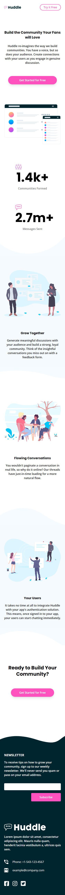

# Frontend Mentor - Huddle landing page with curved sections solution

This is a solution to the [Huddle landing page with curved sections challenge on Frontend Mentor](https://www.frontendmentor.io/challenges/huddle-landing-page-with-curved-sections-5ca5ecd01e82137ec91a50f2). Frontend Mentor challenges help you improve your coding skills by building realistic projects. 

## Table of contents

- [Overview](#overview)
  - [The challenge](#the-challenge)
  - [Screenshot](#screenshot)
  - [Links](#links)
- [My process](#my-process)
  - [Built with](#built-with)
  - [What I learned](#what-i-learned)
  - [Useful resources](#useful-resources)
- [Author](#author)
- [Acknowledgments](#acknowledgments)

## Overview

### The challenge

Users should be able to:

- View the optimal layout for the site depending on their device's screen size
- See hover states for all interactive elements on the page

### Screenshot




### Links

- Solution URL: https://github.com/yogaajie2/huddle
- Live Site URL: https://pedantic-jones-85d39b.netlify.app/

## My process

### Built with

- Semantic HTML5 markup
- Mobile-first workflow
- [Vue](https://vuejs.org/) - JS library
- [Nuxt.js](https://nuxtjs.org/) - Vue framework
- [Tailwind](https://tailwindcss.com/) - CSS framework

### What I learned

Learned to add a custom email validation function. HTML already has its own build-in email validation if you put `type="email"` on an `input` but I don't think you can customize how it looks.

Also learned a lot about static site generation using Nuxt.js and then deploying it to Netlify. Tried Github Pages at first but it just feels more complicated to setup and a bit slow when deploying changes compared to Netlify.

```js
validateEmail: function() {
  const regex = /\S+@\S+\.\S+/;
  
  let validation = regex.test(this.email);

  if (validation) {
    this.isValid = false;
    this.hideCheckEmail = true;
    
    alert('Thank you for subscribing!');
  } else {
    this.isValid = true;
    this.hideCheckEmail = false;
  }
}
```

### Useful resources

- [JS RegEx for Email Validation](https://stackoverflow.com/a/9204568) - Short and simple solution vor email validation.

## Author

- Website - [Yoga Ajie Prasetya](https://github.com/yogaajie2)
- Frontend Mentor - [@yogaajie2](https://www.frontendmentor.io/profile/yogaajie2)

## Acknowledgments

- C. Lee - [c-lee](https://stackoverflow.com/users/270821/c-lee) - For sharing the RegEx solution on Stack Overflow.